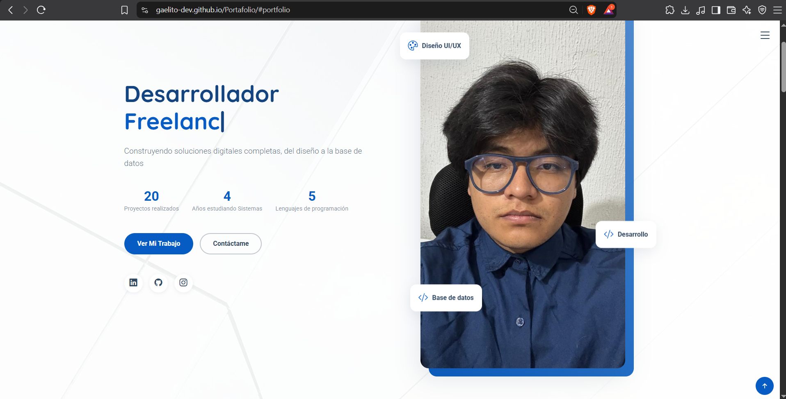
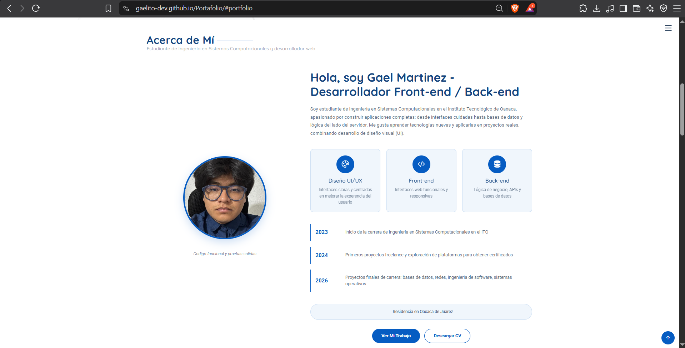
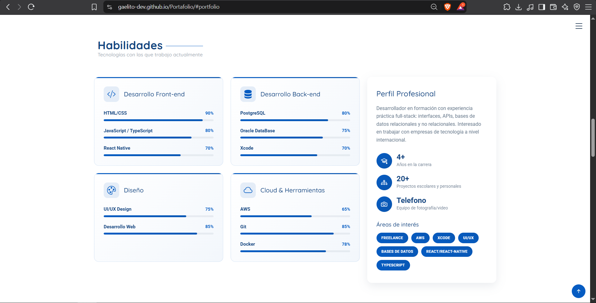
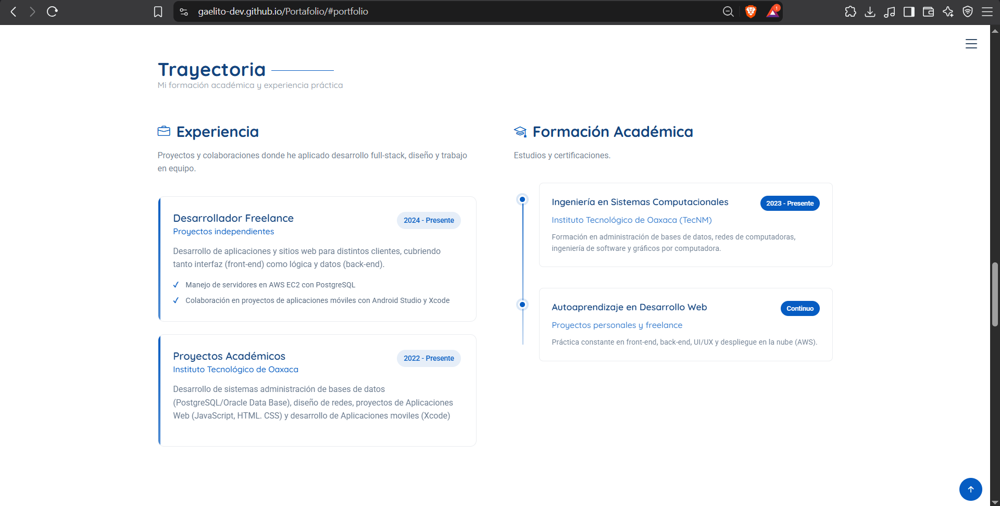
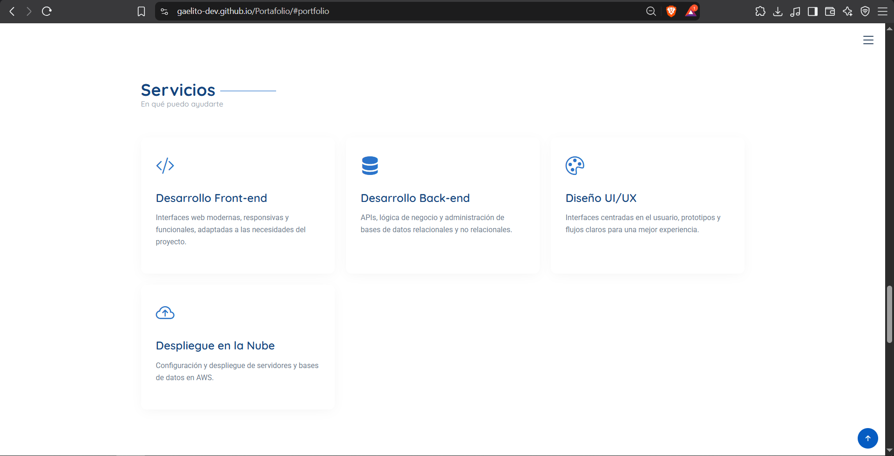
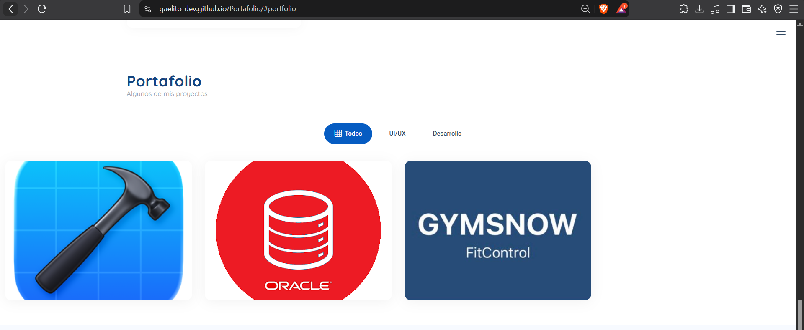
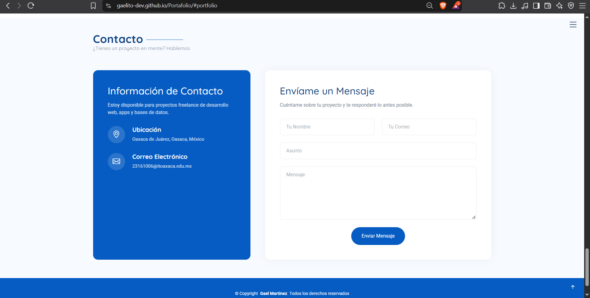

# Portafolio Web Profesional

**Nombre del Alumno:** Gael Martinez Cruz

**Materia:** Programacion Web

**Institucion:** Instituto Tecnologico de Oaxaca

---

# Descripcion
El proyecto esta construido sobre Bootstrap 5.3.8, usando como base la plantilla gratuita "Style" de BootstrapMade.

Plantilla: Style - Bootstrap Portafolio Template

Licencia: Gratuita (BootstrapMade License — https://bootstrapmade.com/license/), por lo que se conservan los créditos "Designed by BootstrapMade" 
Además de Bootstrap, la plantilla integra las siguientes librerías de terceros (carpeta assets/vendor/):
Librería	Función
Bootstrap Icons	Iconografía usada en todo el sitio
AOS (Animate On Scroll)	Animaciones al hacer scroll
GLightbox	Ventana emergente para ver imágenes del portafolio en grande
Swiper	Carrusel deslizable (se usaba en testimonios, sección eliminada)
Typed.js	Efecto de "máquina de escribir" en el título del Hero
PureCounter	Animación de contadores numéricos (estadísticas)
Isotope + imagesLoaded	Filtrado y acomodo en cuadrícula de la sección Portafolio
Menús y secciones que componen el portafolio

SPA El sitio es una sola página (index.html) con navegación por anclas. Las secciones son:
Inicio (#hero) — Portada del sitio. Presenta mi título como "Desarrollador Front-end / Back-end / Freelancer / UX-UI" con efecto de máquina de escribir, una frase de presentación, estadísticas rápidas (proyectos realizados, años en la carrera, lenguajes que manejo) y botones de acceso directo a Portafolio y Contacto.
Sobre Mí (#about) — Presentación personal: quién soy, qué estudio (Ingeniería en Sistemas Computacionales, ITO), tres tarjetas rápidas de fortalezas (UI/UX, Front-end, Back-end) y una línea de tiempo con hitos de mi formación (inicio de la carrera, primeros proyectos freelance, proyectos finales de semestre).

Habilidades (#skills) — Barras de progreso agrupadas en cuatro categorías: Desarrollo Front-end (HTML/CSS, JavaScript/TypeScript, React Native), Desarrollo Back-end (PostgreSQL, Oracle DataBase, Xcode), Diseño (UI/UX, Desarrollo Web) y Cloud & Herramientas (AWS, Git, Docker). Incluye también un resumen del perfil profesional.
Trayectoria (#resume) — Dividida en dos columnas: Experiencia (proyectos freelance y proyectos académicos relevantes) y Formación Académica (mi carrera en el ITO y mi aprendizaje autodidacta en desarrollo web).
Servicios (#services) — Cuatro tarjetas con los servicios que ofrezco como freelancer: Desarrollo Front-end, Desarrollo Back-end, Diseño UI/UX y Despliegue en la Nube.
Portafolio (#portfolio) — Galería filtrable por categoría (UI/UX, Desarrollo) con proyectos reales mi desarrollo en Oracle DataBase la app FitControl y desarrollo de aplicacion movil en Xcode
Contacto (#contact) — Información de contacto (ubicación, correo) y un formulario de contacto (nombre, correo, asunto y mensaje).

Link de descarga de la Plantilla: https://bootstrapmade.com/style-bootstrap-portfolio-template/

# Proceso de Creación

El portafolio se construyó a partir de la plantilla original "Style" de BootstrapMade, siguiendo estos pasos:
Descarga de la plantilla base. Se descargó la plantilla "Style" desde el sitio oficial de BootstrapMade y se revisó su estructura de carpetas (assets/css, assets/js, assets/vendor, assets/img) y el archivo index.html original.
Identificación de secciones. Se recorrió el HTML para entender qué representaba cada sección de la plantilla (Hero, About, Skills, Resume, Services, Portfolio, Testimonials, FAQ, Contact) y qué librerías externas usaba cada una (Typed.js en el Hero, Isotope en Portfolio, Swiper en Testimonials, etc.).
Traducción de contenido. Todos los textos, títulos de navegación y etiquetas se tradujeron al español (por ejemplo: "Home" → "Inicio", "About" → "Sobre Mí", "Resume" → "Trayectoria"), ya que la plantilla original venía en inglés.
Personalización con datos reales. Se reemplazó todo el texto de relleno (lorem ipsum) por información real: mi nombre, mi ubicación (Oaxaca), mi carrera (Ingeniería en Sistemas Computacionales, ITO), mis tecnologías (HTML/CSS, JavaScript, OracleDB, Xocde, AWS, Desarrollo Web, Docker, Git) y proyectos reales que he desarrollado (Aplicaciones Moviles en Xcode, App de Control de Acceso,).

## Eliminación de secciones no relevantes de la plantilla original.

Se quitaron por completo dos secciones de la plantilla original: 
Testimonials: contenía reseñas falsas atribuidas a medios como The New York Times o Washington Post y una calificación basada en Goodreads/Amazon — contenido pensado para un sitio de libros/autor, sin relación con un portafolio de desarrollador.
FAQ: el acordeón de preguntas frecuentes solo tenía texto de relleno sin preguntas reales, por lo que no aportaba valor al portafolio.
También se eliminaron elementos sueltos sin uso (un submenú "Dropdown" vacío en la navegación, íconos de redes sociales que no utilizo, y enlaces "Learn More" sin destino real).
Reducción de contenido repetitivo. Para mantener el sitio enfocado y evitar relleno: 
La sección de Habilidades se redujo a las categorías y tecnologías que realmente manejo.
La sección de Trayectoria pasó de tres experiencias laborales genéricas a dos entradas reales (freelance y proyectos académicos).
Servicios se redujo de 6 a 4 tarjetas relevantes a mi perfil.
Portafolio se redujo de 8 proyectos en 4 categorías a 4 proyectos reales en 3 categorías.
Revisión final. Se verificó que la estructura de Bootstrap, las animaciones (AOS), el filtro de portafolio (Isotope) y el formulario de contacto siguieran funcionando correctamente tras los cambios, y que se mantuvieran los créditos de la plantilla original conforme a su licencia gratuita.

# Capturas de Pantalla 

## Portada

## Acerca de Mi

## Habilidades

## Trayectoria

## Servicios

## Portafolio

## Contacto
